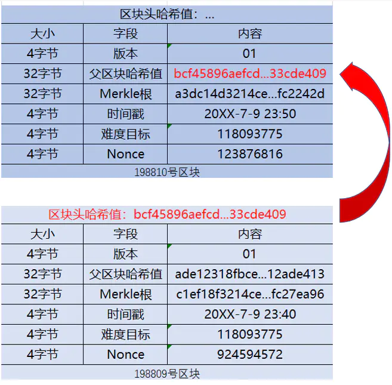
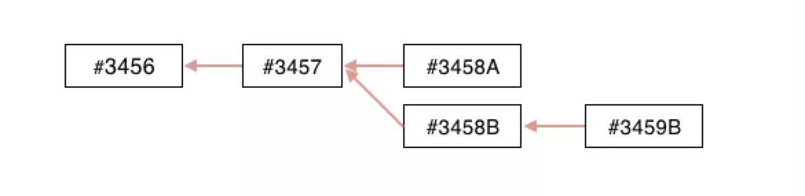
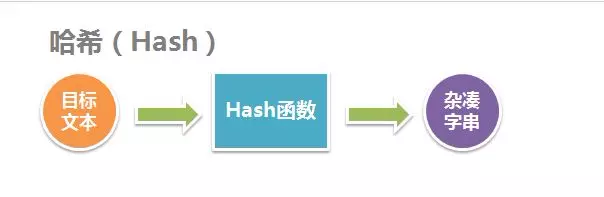

# 区块链常识

观看 csdn 区块链基础写下的笔记

原视频链接: [csdn 区块链基础](https://edu.csdn.net/course/play/27026/351948)

## 区块链常识

    

### 加文·安德烈森

中本聪指定区块链负责人, 比特基金会领导人

### 全节点

参与者: 每个钱包都是一个普通节点

挖矿者: 全节点是一个矿工节点, 有记账权的节点

### 挖矿

在比特币网络中，负责记录比特币交易信息的角色被称为“矿工”。

平均每隔十分钟，矿工们都会将交易记录打包存储到一个新的区块中并获得一定数量的比特币奖励，这就叫做“挖矿”。

挖矿是将一段时间内比特币系统中发生的交易进行确认，并记录在区块链上形成新区块的过程，挖矿的人叫做“矿工”。

> **简单说来，挖矿就是记账的过程，矿工是记账员，区块链就是账本。**

### 比特币是如何产生的?

比特币是通过挖矿产生的。

每10分钟，全网的“矿工”一起计算一道算术题，谁又快又准的算出答案，就相当于获得了记账权，等于挖到了这个区块，这个矿工便能获得系统新生的比特币奖励。

中本聪最初设计比特币时规定每产生 `210000` 个区块，比特币`奖励减半`一次，直至比特币不能再被细分。

### 矿机

在比特币刚诞生的时候，通过计算机的 CPU 便可以挖矿。

随着挖矿的矿工越来越多，算术题的难度越来越大，目前用CPU已经不能挖出比特币了。

于是，开始了用显卡 GPU 做计算开始挖矿；但是普通 PC 的显卡不单单只负责计算，还要负责图形处理，所以连显卡开始也不能满足矿工的要求。

此时，就有人嗅到了商机，改造了传统的 PC ,取名`矿机`。

> 这类电脑配备专业的挖矿晶元，采用烧显卡的方式工作，提高挖矿成功率。

### 矿场

目前比特币网络算力太大，个人购置少量矿机也很难挖出区块。

很多矿工加入矿池一起挖矿，矿场只负责计算，矿池负责信息打包。

矿池挖到比特币之后根据矿场的算力占比分配收益，以此保证更加稳定的投入产出。

**矿场选择条件**

一般选址在电费相对比较便宜并且比较稳定的地方。

因为矿机运行起来噪音比较大，一台矿机运转时，在一米处测试噪音达73dB(a)左右，几千台矿机运转起来的时候对周围的影响可想而知。

### 算力表示

hash/s: 每秒哈希碰撞的次数

一台矿机约：14T hash/s 次碰撞计算

1T hash/s = 1099511627776 次碰撞计算

谁的算力大，谁就比较有概率挖到矿

## 数字货币

量化交易（炒币）

### 跨平台搬砖打价格差

每个平台都有都有差异，此时比较早期可以从低价格平台购买比特币，再从高价格平台卖出，从中赚取差价。

### 趋势交易

趋势的认知，何为趋势？

> 趋势是由不断抬高的高点和不断抬高的低点共同所构成的价格方向

    

根据趋势 购买/卖出 比特币。

### 对冲

同时进行两笔行情相关、方向相反、数量相当、盈亏相抵的交易。

它的宗旨是：

> 寻找投资品种之间的效率落差而形成的套利空间，实现绝对收益，使市场风险最小化。简单来说，对冲就是一种减法，目的是为了剥离我们不想要的风险。

## 钱包

### 全节点钱包

全节点钱包，顾名思义，就是`同步了区块链上的所有节点数据`，它可以参与到网络的数据维护中，具有更为隐秘、验证更快等特点。

全节点钱包里面最具有代表性的是 `Bitcoin Core`。

正因为全节点钱包同步了区块链上的所有数据，因此需要占用很大一部分内存，用户在每次使用前都需要一点时间去同步数据。所以，对于新手来说，全节点钱包的使用体验将是复杂且繁冗的。

### 轻钱包

轻钱包是依赖于区块链上其他全节点，`仅同步与自己相关的数据`，实现部分分布式。

它参考了中本聪提出的SPV机制，不储存完整的区块链数据。

具体来说，轻钱包也会下载新区块的所有数据，但是它会对数据进行分析后，仅获取并在本地储存与自身相关的交易数据，运行时依赖于比特币网络上其他全节点。

### 中心化钱包

完全依赖运行这个钱包的公司和服务器，你存在交易所里的比特币就是中心化钱包（链下钱包）里保存的。

优点：

- 私钥忘记了可以找回
- 平台会把私钥安全做的不错

缺点：

- 你的私钥控制在平台手上，平台“做坏事”你是无法阻止的
- 平台关闭后你的币就没有了

## huobi.pro

数字资产交易平台

账号是一个中心化的钱包

### 虚拟货币如何创造价值?

首先，我们要清晰的定义，我们说的虚拟币的价格是指的什么。

这里面有两个要素：

- 第一，虚拟币有一种`基于其他货币的计价方式`。我们说的价格，是指基于其他货币的价格波动；
- 第二，虚拟币有一个自己的`独立的应用场景和交易市场`。

#### 基于其他货币的计价方式

举个例子，一个区块链社交产品，假设它发行的用于产品内支付的或者激励的币叫做`XYZ`，那么我们所讨论的价格，是指 `XYZ` 对 `BTC`、`ETH`，或者 `XYZ `对 `美元`、`人民币` 等主流法币的价格。

#### 独立的应用场景和交易市场

第二点尤其重要， `XYZ` 必须有自己的特殊应用场景和交易市场。

比如，这个社区限定，社区内的交易，比如打赏、赠送必须以 `XYZ` 支付；

又比如，币安规定交易用 `BNB` 支付可以打折。

无论是强制的还是激励性质的， `XYZ` 必须别的主流货币做不到的地方。

不然，我们完全可以使用主流货币来进行支付，而不使用 `XYZ` 。

#### 应用场景

按照第一段的第二条，虚拟货币要有价值，必须有自己特殊的使用场景。

正经的区块链项目都是有实际用途的，因此一般正规的虚拟货币都有明确的应用目的。

因为现在区块链、虚拟币还不算普及，所以一般的应用场景都比较小。

比如，给某个阅读社区里面的文章作者打赏。国外有Steem，国内有币乎、Primas。

## 区块链

区块链的数据结构就是`单项链表结构`。

你可以把区块链想像成一个个账本，每个人都有一个同步更新的账本，账本里的每一页就相当于一个区块，每当网络里有新的交易时，就会形成新的一页，这一页就是新的区块。

这个记录是真实的，永远存在，不可篡改的。

每个区块里都记满了交易信息，区块按照交易时间一页一页的排序下去，相当于用链条稳定的链接在一起。

    

### 如何挖矿（记账）

中本聪想到了一个办法，打造了一种区块链的共识机制，也是第一代区块链的工作量证明（POW）机制。

什么意思呢？

既然要全网的记录一样，又要全网所有的人一起参与记账，那就公平竞争吧。

区块链会在交易广播出来的同时，给到每一台记账电脑一个算术题和一个随机值，这是一道概率的算术题。

只要你的电脑在全网里首先算出这道题，那么你这个账户就具有在全网唯一记录这笔交易区块的权利。

当你把这笔交易记录在自己的账本以后，你也会把这个消息告诉给其他全网的成员，其他成员在核验你这个记录没有错的时候，就会把你的这个记录交易区块也加到自己的账本中。

这样就实现了区块链账本的唯一性，同步性和安全性。

这便是区块链的主要记账过程。

很多人会把区块链和比特币混为一谈，认为区块链就是比特币，比特币就是区块链，这是不正确的。

## 区块信息

### 区块头

区块头是每个区块中前80个字节，包含以下信息

- 上一个区块的 hash
- 当前区块的 hash
- 时间戳，当前区块的生成时间
- 随机值，算力证明

    

### 交易详情

交易详情，详细记载了每笔交易的信息。

- 转出方
- 收入方
- 金额
- 转出方的数字签名
  - 可用公钥解密出信息

### 交易计数器

交易计数器，表述每个区块中包含交易的数量。

### 区块大小

区块大小，表示每个区块数据的大小。

## 主链

### 最长链原则

前文我们已经详细介绍过“挖矿”的过程，节点完成“工作量证明”算出随机数后即可生成区块并写入区块链，问题来了：

>如果有两个节点同时解出随机数，都把生成的区块广播到网络中随后写入区块链，必然会导致区块链分叉。那么所有节点就不可能有一本公共的总帐本。

如何确认哪一份才是公认权威的总账本呢？

中本聪在论文《比特币：一种点对点网络中的电子现金》中曾介绍，比特币工作量证明机制的本质是一CPU一票，而最长链包含了最大的工作量，所以“大多数人”的决定就可以表达为最长链。

通俗来讲就是，比特币区块是依靠矿工们不断进行数学运算而产生的，**每一个区块都必须引用其上一个区块，因此最长的链也是最难以推翻和篡改的，所以节点永远认为最长链才是有效的区块链，只有在最长链上挖矿的矿工才能够获得奖励**，这就是我们常说的比特币最长链原则。

### 分叉

先来一个定义，在一般情况下，包含最多区块的那个链称为主链。每一个（挖矿）节点总是选择并尝试延长主链。

当有两名矿工在几乎在相同的时间内，各自都算得了工作量证明解，便立即传播自己的“获胜”区块到网络中，先是传播给邻近的节点而后传播到整个网络。

每个收到有效区块的节点都会将其并入并延长区块链。当这个两个区块传播时，**一些节点首先收到#3458A, 一些节点首先收到#3458B，这两个候选区块（通常这两个候选区块会包含几乎相同的交易）都是主链的延伸**，分叉就会产生，这时分叉出有竞争关系的两条链，如图：

    

### 解决分叉

收到#3458A的（挖矿）节点，会立刻以这个区块为父区块来产生新的候选区块，并尝试寻找这个候选区块的工作量证明解。

同样，收到#3458B区块的节点会以这个区块为父区块开始生成新区块，延长这个链（下面称为B链）。

这时总会有一方抢先发现工作量证明解并将其传播出去，假设以#3458B为父区块的工作量证明首先解出，如图：

    

当原本以#3458A为父区块求解的节点在收到#3458B, #3459B之后，会立刻将B链作为主链 **（因为#3458A为顶点的链已经不是最长链了）** 继续挖矿。

## 以太坊的分叉

### 软分叉

在数字币挖矿中，每一位矿工通过计算机来进行计算，就好比解答一个数学题，如果谁先把这个题目解答出来，那么他就会告诉别人，我已经完成了，你们快看，全体矿工就会把这一笔记录在自己的账本之上，然后再来开始新的记账过程，可是会有一个极端的情况出现，两个矿工同时完成应该怎么办？由于每个矿工区块的数据都不一样，所以他们解题得出的结果也是不一样的，都是正确答案，只是区块不同。

于是，区块链在这个时刻，出现了两个都满足要求的不同区块。那么，全体矿工这时该怎么办呢？ 由于距离远近，不同的矿工看到这两个区块是有先后顺序的。通常情况下，矿工们会把自己先看到的区块复制过来，然后接着在这个区块开始新的挖矿工作。而在以后就会出现两条不一样的链，后面的矿工就会在两条不同的链上进行工作，而在在分叉出来的两条不同链上，跟随的矿工数量就会不一样，而在以后，两条链就会又不一样的长度，当其他的矿工发现一条链更长的时候，就会抛弃他当前的链，把长的链全部复制回来，在这条链的基础上继续挖矿。**这样久而久之，两条链一条成为了主链，而另一条逐渐就消失了，这种分叉叫做软分叉**，而另一种就是产生的链不消失，而这种就叫做硬分叉！

> 一句话概括：最长链原则解决的分叉就叫做软分叉。

### 硬分叉

因为区块链的共识发生了分歧，而产生的新共识规则发布之后，**一些没有升级的节点无法验证已经升级的节点生产出来的区块**，如果不能达成一致，分叉有可能会出现**分叉币**。

### 历史上最出名的硬分叉事件

事件发生在2016年，是由以太坊创始人Vitalik Buterin主导的。

5月底一个叫做The DAO的项目众筹成功上线，并且逐渐在各大交易所开放交易。

6月上旬，以太坊开发人员发现The DAO存在漏洞，其中的币可能被转移而原有地址的币不会减少，也就意味着可以不断重复向外转出个人账户内的币。

6月中旬，有黑客利用此漏洞总计向外转出了1200万个以太币，几乎占据了The DAO众筹总量的三分之一。

虽然相继提出了通过发送大量垃圾交易阻塞交易验证以减缓黑客的继续偷盗、软分叉等解决方案，但是都不能有效解决这一问题。

于是，6月底，以太坊创始人Vitalik Buterin提出硬分叉设想，**通过硬分叉使得黑客利用漏洞转出交易的区块失效**。

7月中旬，超过85%的以太坊算力支持硬分叉，以太坊硬分叉成功。

**新链是以太坊（ETH），原链是以太经典（ETC）**。

为什么会有15%的算力不支持硬分叉呢？

因为硬分叉实际上是违背了区块链“不能修改”的技术本质，采用了人为手段“强制回滚”。

因而在部分区块链信仰者看来，Vitalik Buterin的硬分叉是对区块链的背叛，他们反对硬分叉，并且坚定地为原链（ETC）继续贡献算力。

> 总结：
> 以太坊（ETH）是现在以太坊官方流行的币种（85%算力支持）
> 以太经典（ETC)是旧的币种（15%的算力支持）。

## 区块链分类

### 公有链
公有链，顾名思义，从字面上理解，就是“公有”，它是指对全世界所有人开放的，任何人都可以读取数据、发送交易且交易能够获得有效确认的共识区块链。

比特币、以太坊，大家熟悉吧？这两者采取的都是公有链。因为没有限制，任何人都可以参加。

### 私有链
私有链，也称专有链。它是一条非公开的“链”，通常情况，需要授权才能加入节点。而且私有链中各个节点的写入权限皆被严格控制，读取权限则可视需求有选择性地对外开放。

### 联盟链
联盟链是指由多个机构共同参与管理的区块链，每个组织或机构管理一个或多个节点，其数据只允许系统内不同的机构进行读写和发送。

联盟链的各个节点通常有与之对应的实体机构组织，通过授权后才能加入与退出网络。各机构组织组成利益相关的联盟，共同维护区块链的健康运转。

从某种程度上来说，其实联盟链也属于私有链，但它私有的程度不同，其权限设计要求更复杂，可信度更高。

## 匿名级别

除了比特币，还有很多山寨币，为什么山寨币会被热炒，很多就是和匿名级别有关。

### 比特币

比特币的**匿名性，可追溯，账本公开透明**是它的主要特性之一。

当然，比特币钱包对应的背后的用户是谁，这点是完全匿名的，但也不是不可以得知。

由于比特币要和法定货币(比如说人民币)进行交换，所以交易所就是必经的节点。

目前由于各国对于比特币交易所的限制，交易所一般都是需要进行实名验证的（当然，你也可以尝试绕开实名验证）。

在交易所购买比特币之后，如果你需要把比特币转移到你自己的钱包内，就需要发起转账，那交易所就会知道你的(被转账的)钱包地址，自此之后，交易所就有能力追溯这个钱包所有的资金流向了。

当然，绝大多数的钱包也仅是一串无意义的字符，很难得知背后的用户是谁。

> 概括: **比特币可以查询地址的全部转账记录，知道了地址属于谁就知道了其资产。**

### Monero（门罗币）

Monero (XMR)是一种加密货币，专注于不可追踪和隐私。它的设计有几个关键方面与比特币不同，但它应该被理解为一种类似于比特币的加密货币——它可以用来买卖东西，也可以用来交换其他货币或代币。

因此，Monero XMR是一种专注于隐私和匿名的加密货币。比特币实际上是假名的，它的交易仍然可以追踪，而XMR交易可以像实物现金一样完全匿名。它是原隐私币Bytecoin的分叉。

当然，每一美元上都有一个序列号，方便联邦存款保险公司担保的银行和政府追踪。但我们在不用查看某人的银行账户余额的前提下，也接受他们的美元账单。同样地，当你使用借记卡或信用卡时，零售商只需要验证你是否有足够的钱支付交易。

强大的加密技术，最新型的区块链，以及无限的供应量，使得Monero成为一种强大的，有着扎实的未来的隐私硬币。

> 概括: **洗钱之宝**

### Zcash(匿名数字货币)

混币器就是一种匿名交易的解决方案。通俗点说，区块链上有多个搅拌器，要转账的每个币都要经过搅拌器和许多别的币混合，这样，从混币器出来后，除了混币器节点，别人谁都不晓得这个币来自哪里。用户把一组币委托给混合器，然后从混合器中取出等价值的币。达世币（Dash）就是采用了混币器方案。

> 概括: **洗钱之宝**

## 共识机制

### POW：Proof of Work，工作量证明

比特币系统以每个节点的计算能力即“算力”来竞争记账权。大约10分钟进行一轮算力竞赛， 胜利者获得一次记账权， 并向其他节点同步新增账本信息。

如何判定竞争的结果，就需要通过一个称为“工作量证明（Proof of Work, PoW）”的机制完成，工作端需要做一定难度的工作得出一个结果， 即消耗大量的算力， 而验证方确很容易通过结果来检查工作端是否做了相应的工作。

比特币的工作量证明俗称“挖矿”。每个矿工解决问题的可能性依赖于他的算力，挖矿的难度由系统中所有算力的总和来决定。

因为它需要计算力的资源，成功的矿工会得到比特币作为奖励。

PoW的三个关键要素是：

1、工作量证明函数，

2、区块，

3、难度值。

### Proof of Stake 权益证明

主要思想是：节点记账权的获得难度与节点持有的权益成反比，也就是说，一个节点拥有的币越多、时间越久，越容易获取记账权，也就越容易获取区块奖励。

实际上，最初的PoS是PoW的一种升级，根据每个节点的币龄，来等比例地降低挖矿难度，从而加快找到随机数的速度。

> 什么是币龄呢？

币龄=数量*拥有天数。

由于区块链中的每笔交易记录都会被标记时间戳，这个时间戳就可以作为币龄的证明，因此币龄也不可能被轻易伪造。

比如韭菜芯儿从韭菜芽儿那里收到10个币，并且持有了90天，那么，韭菜芯儿就拥有了900的币龄；如果韭菜芯儿卖了这10个币，这900币龄就被消耗了；

如此一来，PoS区块链的作用过程就可以这样描述：

在初期，通过PoW机制，产生创世币；

在创世币达到一定规模时，PoS机制开始作用，交易时消耗币龄、获得产生区块的优先权，并获取利息，同时PoW机制由于消耗太多资源、浪费算力而逐渐淡出；

最终系统中仅剩PoS来维持正常运作。

### Delegated Proof of Stake，委任权益证明

中文名叫做股份授权证明机制（又称受托人机制），它的原理是让每一个持有比特股的人进行投票，由此产生101位代表 , 我们可以将其理解为101个超级节点或者矿池，而这101个超级节点彼此的权利是完全相等的。

从某种角度来看，DPOS有点像是议会制度或人民代表大会制度。如果代表不能履行他们的职责（当轮到他们时，没能生成区块），他们会被除名，网络会选出新的超级节点来取代他们。

DPOS的出现最主要还是因为矿机的产生，大量的算力在不了解也不关心比特币的人身上，类似演唱会的黄牛，大量囤票而丝毫不关心演唱会的内容。

比特股引入了见证人这个概念，见证人可以生成区块，每一个持有比特股的人都可以投票选举见证人。

得到总同意票数中的前N个（N通常定义为101）候选者可以当选为见证人，当选见证人的个数（N）需满足：至少一半的参与投票者相信N已经充分地去中心化。

见证人的候选名单每个维护周期（1天）更新一次。

见证人然后随机排列，每个见证人按序有2秒的权限时间生成区块，若见证人在给定的时间片不能生成区块，区块生成权限交给下一个时间片对应的见证人。

DPoS的这种设计使得区块的生成更为快速，也更加节能。

DPoS充分利用了持股人的投票，以公平民主的方式达成共识，他们投票选出的N个见证人，可以视为N个矿池，而这N个矿池彼此的权利是完全相等的。

持股人可以随时通过投票更换这些见证人（矿池），只要他们提供的算力不稳定，计算机宕机，或者试图利用手中的权力作恶。

> 概括： **代理人记账**

## hash （哈希）算法

    

### 哈希算法的性质

1.单向性

如上面的例子，**可以将文本“Fox”计算出哈希值“DFCD3454"**, 而**不能用由”DFCD3454“推算出他的输入”Fox“**。正如将玻璃砸碎很容易，却很难将碎玻璃拼凑成一块完整的玻璃。

2、任意长度的消息计算成固定长度哈希值

因为哈希算法的一个目的是为了用最后哈希值代替原始值减小校验难度和传输成本。如果哈希值的长度过大甚至和原来消息一样大，哈希算法就失去了意义，因为这样校验原来信息和哈希值的难度差别不大。

3、计算哈希的时间短

无论原始数据有多大，哈希算法的计算时间要在可接受的范围内。

4、不同的输入就有不同的输出

这是哈希算法发明出来的目的之一，但是数学上任意长度的数据经过一个函数计算产生定长数据，该结果一定存在重复的可能性。哈希算法只是将这种可能性降到很小接近0。两个不同输入产生相同输出的现象叫做“碰撞”。

## 以太坊

### 超越比特币及第一代去中心化应用

尽管区块链的概念经常和比特币一起出现，也有很多区块链应用已经超越了数字货币的范畴。实际上，比特币只是当今几百种区块链应用中的一种。

「区块链之于比特币，就如同互联网之于电子邮件。区块链是一个巨大的电子系统，可以在其基础上构建应用。**货币只是基于区块链的一种应用**。」

不久之前，构建区块链应用仍然需要复杂的编程、加密和数学领域的背景知识，以及海量的（计算）资源。不过现在形势变了。先前无从想象的应用，从电子投票和资产电子记录，到合规（regulatory compliance）和交易都在以前所未有的速度被开发和部署。以太坊通过为开发者提供工具来构建去中心化的应用，让这一切成为可能。

### 以太坊像比特币吗？有点儿像，但不完全一样。

比特币只提出了一种区块链应用，即点到点电子现金系统，可以实现线上比特币支付。比特币的区块链用来追踪电子货币（比特币）的所有权，而**以太坊的区块链专注于执行任何去中心化的应用的代码**。

**在以太坊区块链中**，矿工挖的不是比特币，**而是以太币**，一种给网络提供燃料的加密货币。以太币不仅是可交易的加密货币，应用的开发者还可以用以太币来支付交易费和以太坊网络的服务费。

### 以太坊虚拟机

以太坊的核心创新是以太坊虚拟机（EVM），它是运行在以太坊网络上的图灵完备软件。

如此，只要有足够的时间和内存，任何人都可以用任何语言运行任何程序。

以太坊虚拟机让创建区块链程序变得前所未有的简单和高效。

不用为每个新应用都创建一个原生的区块链了，以太坊使得在一个平台上开发数千种不同应用成为可能。

某种程度上说，以太坊就跟Windows、Android、iOS一样，是一个可以运行应用的底层操作系统。而以太坊的核心，就是以太坊虚拟机EVM，其主要工作是执行智能合约。

因为以太坊是图灵完备的，所以开发者能够使用既有的编程语言JavaScript和Python等语言，创建应用，运行在以太坊虚拟机上。

### 以太坊有什么用？

以太坊帮助开发者构建并部署去中心化的应用。去中心化应用或者说 Dapp 为其用户提供一些特定的功能。比如，比特币是一种 Dapp，为其用户提供了点对点电子货币系统，从而实现了在线比特币支付。因为去中心化应用由运行在区块链网络上的代码构成，它不受任何个人或中心化实体的控制。

### 技术架构

区块链从底层到表面通常有六层，以太坊的架构如下：

- 数据层：分布式区块链；
- 网络层：p2p网络
- 共识层：POW+POS
- 激励层：挖矿机制
- 合约层：EVM+智能合约。以往的区块链没有这一层，因而无法运行复杂的智能合约，直到以太坊等底层公链的出现。
- 应用层：运行在以太坊上的DAPP

### 个人概括

以太坊是区块链2.0，它更像一个平台，开发所需要的基本设施都搭建好。

开发者可以更加简单的在以太坊的平台上进行开发 **Dapp（去中心化的应用程序）**

## 总结

区块链还是萌芽的阶段，需要学习，除了技术方面的知识，更需要去思考应用场景和商业思维，能够在这个方向有所收获。

**低迷即将离去，美好正在萌芽。😀**