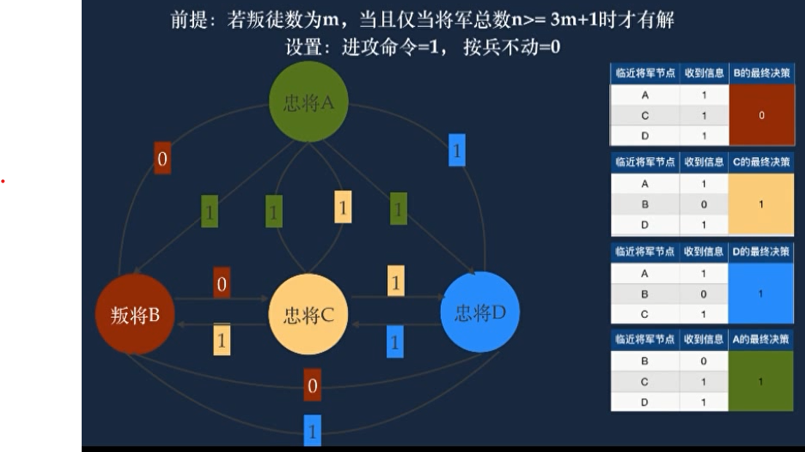
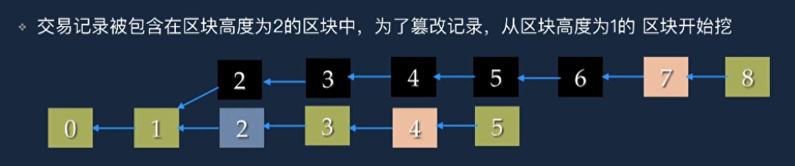
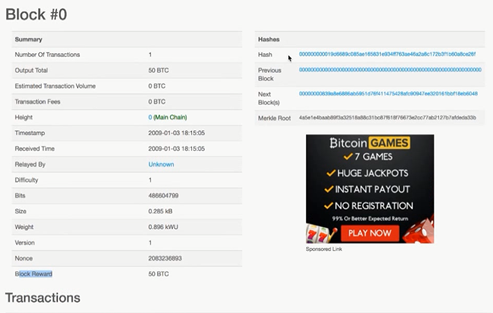
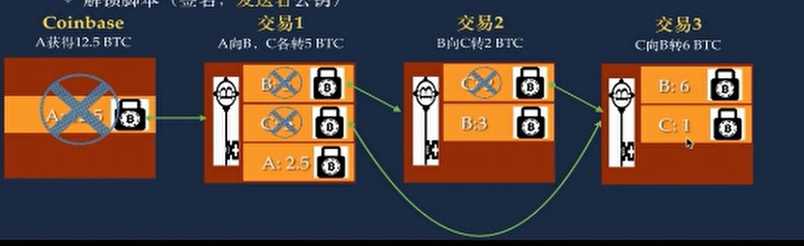
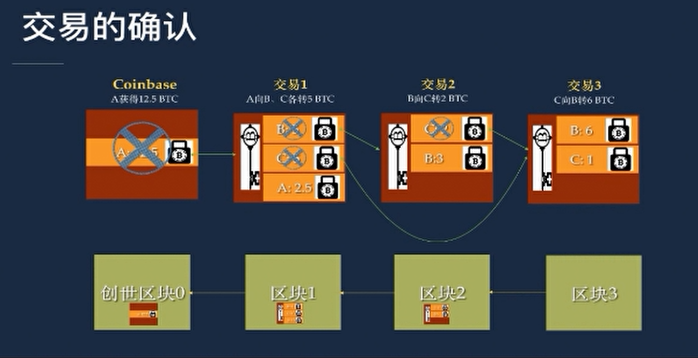
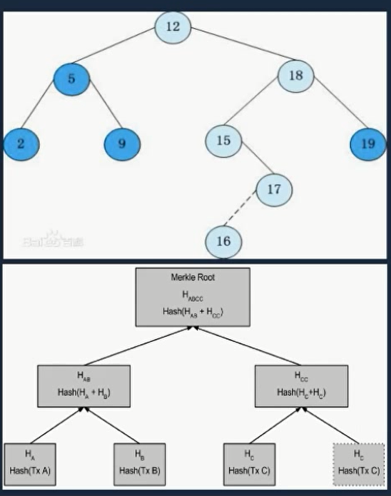

# 区块链先导课

## UTXO

交易比特币包括三项

1. 交易的输入 UTXO 指针
2. 交易的输出 UTXO
3. 解锁脚本 (私钥签名,公钥)

## 比特币是货币吗

货币的属性

- 交易媒介
- 稀缺资源
- 性质稳定,不易磨损
- 防伪造
- 广泛接受

## 比特币市场价格地位

- 1比特币 > 1盎司黄金
- 全球大部分国家可以交易
- 易携带
- 比特币以外的数字都叫 "山寨币"

## ICO 首次公开代币发售

消防 IPO

如何判断ICO

http://ICON.info

- 读懂白皮书
- 开发团队
- 天使投资人

# 第一章

## ICO VS IPO

**IPO**

1. 种子轮
   1. 又称为 PPT 创意, 有个 idea 就可以
   2. 成功率 七分之一
   3. 投资人一般都是 3F, Friend, Family, Fool
2. 天使轮
   1. 能做出个 DEMO , 上线了
   2. 融资 500 万以内
3. X轮 (preA,B,C,D,E...pre-IPO)
   1. VC 风投 A轮
   2. PE 基金 一般出现在 D轮 E轮
4. IPO
5. 进入二级市场

二级市场: 股市, 大牛市, 1到2倍收益很不错了

一级市场: 投行 VC , PE 大机构等 , 回报 4 - 5倍

**ICO**

ICO 过程

1. 白皮书
2. 二级市场

区别:

> ICO 很早的融资, 获得代币, 没有公司股权, 风险极大, 关注产品本身(解决市面上问题)
> IPO 成熟期的融资, 获得公司股权, 风险极小, 关注财务数据 + 现金流

## 判断 ICO 项目

1. 免费送币的直接 Pass
2. 白皮书用简单易懂表达(模式是否清晰),
3. 解决了什么问题, 区块链是必须的吗 (看产品)
   1. 不用区块链能否解决, 为什么一定是区块链
4. 发行币是否有必要, 使用系统是否消耗代币
   1. 如果没有必要, 公司成败和投资者没有太大关系
5. 能否快速上市交易, 有交易所背书
6. 代码是否开源, github代码更新频繁和数量
   1. 开源有利于大家监督, 是否有 **猫腻**
   2. 如果代码有漏洞, 能够及时发现
   3. 如果 github 更新不频繁, 会觉得没人在开发这个项目
7. 传世团队背景(学历,工作), 技术团队是否有区块链开发经验
8. 站台的早期投资人, 相关领域专家

## EOS解读

以太坊升级版

- 每秒支持数百万交易, 三秒钟产出一个区块 (以太坊14秒)
- 运行智能合约免费, APP开发者根据拥有的 EOS 代币数量使用系统的存储资源 (以太坊运行智能合约需要付费)
- DPOS 共识机制, 无需挖矿, 不容易产生飞叉
- 用非硬分叉处理智能合约(以太坊 theDAO 漏洞)
- 兼容多种开发语言和 VM 虚拟机(支持以太坊智能合约运行在 EOS )
- 系统使用费用与 EOS 代币当前价格无关(解决了以太坊Gas价格问题)
- 交易所支持站台
- 主创人 CTO (ByteMaster) 技术天才
- EOS 代币方案, 只接受ETH

## 对监管的解读

- 防范代币发行ICO融资风险公告
  - 2017年09月04日 15:00 联合颁布
  - 一种未经批准非法公开融资的行为,以非法集资, 金融诈骗,传销等违法犯罪
  - 已完成代币发行融资的组织和个人应该清退
  - 代币融资平台不得从事 货币与代币与 虚拟货币相互之间转换的业务

简单总结: 目前政府对ICO是保持防范的态度, ICO风险很高

## 如何面对 ICO 退币 & BCC

- 在国外交易所是否可交易
  - 如果国外不可交易, 国内又禁止交易... 很容易暴雷
- 监管前是否只在一个或极少数交易所交易

# 第二章

## 比特币特性

- 硬通货
  - 支持跨境交易
- 易携带
  - 只需要一个私钥
- 隐秘性
  - 只暴露钱包地址
  - 非法用途
- 无货币超发
  - 通货膨胀
  - 通货紧缩 

## P2P(Perr-to-Perr) 网络

- 中心化服务器
  - C/S , B/S 架构
  - 客户端完全信任服务器
  - DDOS攻击 分布式拒绝服务攻击
    - 比喻: 你是开饭店,对外服务,一群黑社会坐满了你的餐位,并且不点菜. 让真正需要吃饭的人没位置坐.
    - 黑客, 控制大量肉鸡, 去高并发访问你的服务器, 导致你服务器崩溃
- P2P
  - 去中心化
  - 地位平等, 无主从之分
  - 用户越多, 访问速度越快
  - 抗攻击

## 拜占庭将军问题

- 一个关于分布式节点系统容错的故事
  - 背景:
    - 拜占庭帝国派出10支军队去围攻一个强大的敌人
    - 至少需要6支军队同时进攻才会胜利
  - 难题:
    - 里面有叛徒, 违背进攻意向
  - 解决:
    - 每个节点给所有节点发送信息, 根据每个节点的反馈来决定最终的策略
  - 缺点:
    - 每个节点向全网节点发送大量的信息

解决方案:
若叛徒数量为 m , 当且仅当将军总数 n >= 3m+1 时候, 才能战胜敌人

   

## 比特币共识机制 - 工作量证明 POW

怎么证明我是好人

- POW 
  - 通过付出大量工作代价来证明自己是非恶意节点
  - 计算出一个难题随机答案(nonce)
  - 获取记账权利
  - 打包交易并通知其他节点
- 理性人都是逐利的, POW 抑制了节点恶意动机

## 比特币-BTC的产生

- 比特币挖矿产生一个随机数 nonce
- 生成的BTC被记录在矿工的名下
- BTC 通过矿工的公钥的哈希锁定
- 交易的输出被称为 为花费交易 UTXO 

## 区块链-分布式账本

在比特币系统中, 区块链的作用是分布式账本

0 <- 1 <- 2 <- 3 <- 4 <- 5 <-6
- 数字代表区块高度
- 通过共识机制, 获得生成区块的记账权力
- 基于 P2P 每个全节点都存储了一份历史完整的比特币交易账本
- 新区块包含前一个区块头部哈希值建立链接关系
  - 区块链像一列火车,每个车厢就是一个区块,每节车厢装满交易记录
- 经过6个区块确认才是安全的
- 为什么 0 <- 1  而不是  0 -> 1 ?
  - 区块1有区块0的信息, 所以区块1指针指向了区块0
  - 为了方便溯源, 知道区块链6是从区块0产出   

## 区块链-篡改历史交易

理性人: 逐利的人

比特币 POW 算法是基于每个矿工都说理性人的前提下设计的

凭借超过 51% 的算力, 并且在分叉高度开始算, 超过6个区块高度你就能成功把自己的 分叉链 作为最长链

   

Q:
1. 区块链系统会被搞跨吗?
2. 现在的山寨币为什么不适用 POW 工作量证明?

A:
1. 如果矿工联合起来是很容易破坏比特币的, 矿工联合起开打造一条恶意分叉, 否定诚实链的所有交易, 那么比特币系统就会崩溃, 比特币变得一文不值
2. 因为其他币敢用 POW , 随便一个矿池都可以把这条链废掉

## 常用术语

### 挖矿

- 在全网和其他节点竞争算力, 证明自己是非恶意节点
- 获得权力和记账
- 获得奖励

### 创世区块

比特币第一个区块

   

### Coinbase

挖矿产生的比特币, 从每次 50, 25, 12.5 

### 区块高度 区块深度

区块高度: 当前区块高度

区块深度: 对区块的确认数的说法 

比如说: 区块深度1, 只有一个确认数, 还没到区块深度6, 因为深度6是为安全的区块

### 交易确认

- 在每一项交易收录后, 就是确认交易
- 在此区块之后, 每一个产生一个区块, 此项交易的确认书相应加1

# 第三章 密码学

## 进制 - 一种计数方式

二进制 , 十进制 , 十二进制

## 计量术语

- 位 (bit) 计算机最小数据单位
- 字节 (Byte) 8个 bit 组成, 存储空间最小单位
- KB  1024B
- M   1MB = 1024KB
- G   1G  = 1024MB
- T   1T  = 1024GB
- P   1P  = 1024TB

## 对称加密

- 用相同密钥对原文进行加解密
- 加密过程: 密钥 + 原文 = 密文
- 解密过程: 密文 - 密钥 = 原文
- 缺点: 无法确保密钥安全传递

## 非对称加密 - 公钥 / 私钥

- 公钥用于加密, 私钥用于解密
- 公钥由私钥生成, 私钥可以推导出公钥
- 从公钥无法反推私钥
- 优点: 解决了密钥传输安全问题

例子:

A需要给B发送一个信息 abc

B此时给了个公钥给A

A使用公钥进行加密, 加密完成后把密文发送给B

B使用自己的私钥进行解密

## Hash

- 不可逆, 几乎无法通过 Hash 推导出原文
- 无碰撞性, 几乎没有可能找到一个Y,使得y的Hash值等于X的哈希值
- 使用场景
  - 服务器中保存的密码
  - 签名

哈希用户密码存储

1. 明文存储, 没有任何安全防护
2. 哈希存储, 对密码使用 Hash 混淆, 黑客可以使用彩虹表攻击
3. salt + hash 使用 Hash 混淆的同时, 加上 时间戳, 之类的与 明文密码混淆 再 hash 加密

## 数字签名

数字签名的意义,防止发送方内容中途被篡改

主要是确认发送信息的人

签名步骤

- 发送方
  1. 使用非对称加密: 对原文使用 **接收方** 的公钥进行加密
  2. 使用摘要: 对原文使用 Hash 加密, 生成摘要(什么是摘要, 因为如果对全文进行加密 效率很慢)
  3. 再对`摘要`使用 **发送方** 的私钥做一个加密, 变成签名
- 接收方
  1. 对仅仅只有使用非对称加密的密文, 用接收方私钥进行解密, 还原出原文
  2. 再对原文进行 Hash 加密生成密文
  3. 对签名使用**发送方**的公钥解密, 还原出摘要
  4. 用 第1步 与 第3步 还原出的数据进行对比, 一致则证明没有被篡改

## CA 证书授权中心

- CA  解决了电子商务中公钥的可信度问题
- 负责证明 "我就是我"
- CA 是受信任的第三方, 公钥的合法检验
- CA 证书的内容
  - 证书持有人的公钥
  - 证书授权中心的名称
  - 证书有效期
  - 证书授权中心的数字签名

# 第四章

## UTXO Unspent TransXtion Output 未花费交易输出

- UTXO 用比特币拥有者的公钥锁定(加密)的一个数字
- UTXO == 比特币
- 比特币系统里没有比特币, 只有 UTXO
- 比特币系统里没有账户, 只有UTXO (公钥锁定)
- 比特币系统里没有帐户余额, 只有UTXO (账户余额只是比特币钱包的概念)
- UTXO 存在全节点的数据库里
- 转账将消耗属于你自己的UTXO, 同时生成新的UTXO, 并用接受者公钥锁定

## 交易结构

- https://blockchain.info/
- 交易的输出(UTXO)
  - 锁定的比特币数量
  - 锁定脚本(用接收者的哈希公钥)
- 交易的输入 (UTXO + 解锁版本)
  - 解锁版本(签名,发送者公钥) 

   

   

## 交易验证 - 基于栈的脚本语言

- 栈(stack)
  - 先进后出
  - 如同子弹夹
- 交易验证
  - 对栈的操作: OP_DUP
  - 逻辑运算: OP_EQUALVERIFY
  - 加解密运算符: OP_HASH160, OP_CHECKSIG
  - 算数运算符: OP_ADD, OP_SUB, OP_MUL, OP_DIV

### 逆波兰表示法

- 规则
  - 所有操作符位于数字后方
  - 遇到数字 Push (压栈)
  - 遇到二元运算符( + - * /)
    - 先将2个操作数字出栈 POP
    - 然后对运算数进行计算
    - 最后将结果压栈
- 传统表达式: (1+2)*3 == 9
- 逆波兰: 1 2 + 3 * 9 ==

1 2 + 3 * 9 == 过程如下:

1. 把 1 压入栈中
2. 把 2 压入栈中
3. 遇到了 + 号, 两个数字弹出来 进行运算 得出结果 3
4. 把运算结果 3 压入栈中
5. 把 3 压入栈中, 没有运算符
6. 遇到 * 乘, 把 两个 3 弹栈 进行运算 得出结果 9
7. 把 9 压入栈中 
8. 遇到 == 符号, 把 9 进行一个运算 得到 true 
9. 把 true 压入栈中 

## 校验验证

- 锁定脚本
  - OP_DUP OP_HASH160 <发送者公钥哈希> OP_EQUALVERIFY OP_CHECKSIG
- 解锁脚本
  - <发送者签名><发送者公钥>
- 交易验证: 运行解锁脚本 + 锁定版本 = True

# 第五章

## 交易的传播 & 验证

- 交易包含两个部分, n输入和m输出, n>=0, m>0
  - 什么情况下 输入是可以等于0?? 挖到新区块的时候
  - 输入 == 要花费的 UTXO + 解锁脚本
  - 输出 == UTXO (币值 + 锁定脚本) 
- 钱包软件生成交易, 并向相邻节点传播
- 节点对收到的交易进行验证, 并丢弃不合法的交易
  - 交易的size要小于区块的 size 上限
  - 交易输入 UTXO 是存在的
  - 交易输入 UTXO 没有被其他交易引用 - 防止双花
  - 输入总金额 > 输出的总金额
  - 解锁脚本验证
- 将合格的交易加入到本地的 Transaction 数据库中, 将合法交易转给临近点

## 区块的生成

- 矿工在挖矿前要组件区块
  - 将 coinbase 交易打包进区块
  - 将交易池中最高优先级的交易打包进去区块
    - 优先级 = 交易额度 * UTXO 深度 / 交易的 size
    - 防止粉尘攻击
  - 创建区块头部
    - 版本号 - 父区块哈希 - Merkle 树根 - 时间戳 - 难度值 - Nonce
- 挖矿成功后,将计算出来的随机数 nonce 放入区块头部 向临近节点传播

## 区块链验证链接

- 相邻节点收到新区块后, 立即做下面检测
  - 验证POW的 nonce 值是否符合难度值
  - 检测时间戳是否小于当前时间2小时
  - 检查 Merkle 树根是否正确
  - 检查区块 size 要小于区块 size 的上线
  - 第一笔交易必须是 coinbase 交易
  - 验证每个交易

## Merkle Tree 结构

- 树 - 由多个子节点组成的一种数据结构
  - 每个节点存储数据
  - 根节点 Root
  - 父节点, 父节点,兄弟节点
- 构建二叉搜索树
- Merkle Tree
  - 防止数据篡改
  - 快速验证某个交易是存在
  - 节点存储 Hash
  - 从叶子节点构造树

   

# 第六章

## 软分叉

- 由比特币交易的数据结构改变引起, 但区块的数据结构未改变
- 老节点节点接受新旧格式的区块, 新节点只接受新区块
  - 矿工激活软分叉 MASF - Miner Activated Soft Fork
  - 用户激活软分叉 UASF - User Activalted Soft Fork
    - Core 团队新发明, 应对矿工不合作
    - 隔离见证Segwit-Segregation Withness

## 硬分叉

- 由于交易结构的变化,或者区块的结构的变化引起的
- 新旧节点互相拒绝对方的区块
- 产生两种币, 如 BCC

# 第七章

## 钱包地址的生成

1. Random 生成私钥
2. 通过算法生成公钥
3. 通过 hash 运算 SHA256
4. 
