# 经济基础知识

[人人都能懂宏观经济](https://study.163.com/course/courseMain.htm?courseId=1005227017)

一下内容是观看视频笔记。

## 什么是 GDP ?

一个国家或者一个地区所管辖的地区一年内,创造了多少物质财富,这个财富的指标就是 GDP

> 电视机厂商生产的电视机成本500元,销售价是600元,多出的100元 就是 GDP 数值

### 作用

1. 能够反映国民的经济发展情况
2. 为国家以及各地区经济战略目标和宏观经济政策决策提供依据。
3. 世界上衡量一个国家经济地位的指标。
4. 经济判别的指标

### 计算方法

1. 生产法
2. 分配法
3. 支出法

> 无论用哪个方法计算，理论上结果都是一致的。

### 凯恩斯经济计算模型

GDP = 总产出 = 消费（C）+投资（I）+政府购买（G）+净出口（X-M）

一万斤橙子 = 茅台酒 + 衣服鞋子包包 + 家具 + （橙子-肉）

总支出 = 总产出 = 总收入

> 总产出（橙子）=总支出（我买钻戒花的钱）=总收入（钻戒商人的收入）
> 把无数这样的交易加总，就是宏观经济的总量。

**一个人的支出，就是另外一个人的收入。**

## GNP 

GNP 就是一个国家所有国民在一定的时期内生产的产品和服务价值的总和。

### GDP GNP 区别

GDP 针对的是企业

GNP 针对的是人

## 产业层次

第一产业是指农、林、牧、渔业（不含农、林、牧、渔服务业）。

第二产业是指采矿业（不含开采辅助活动），制造业（不含金属制品、机械和设备修理业），电力、热力、燃气及水生产和供应业，建筑业。

第三产业即服务业，是指除第一产业、第二产业以外的其他行业。

第三产业包括：

交通运输、仓储和邮政业，信息传输、计算机服务和软件业，批发和零售业，住宿和餐饮业，金融业，房地产业，租赁和商务服务业，科学研究、技术服务和地质勘查业，水利、环境和公共设施管理业，居民服务和其他服务业，教育，卫生、社会保障和社会福利业，文化、体育和娱乐业，公共管理和社会组织，国际组织等行业。

**意义**

当前加快发展第三产业的重要意义，主要是：
1、有利于建立和完善社会主义市场经济体制；
2、有利于加快经济发展，提高国民经济素质和综合国力；
3、有利于扩大就业，缓解中国就业压力；
4、有利于提高人民生活水平，实现小康。

## 什么是经济增长

总量：一个国家或者地区在一定时期内总产出与前期相比实现的增长。

个量：一个国家人均产出（或人均收入）水平持续增加。

2017年数据：
| 数据/国家| 美国|日本|中国|
|-|-|-|-|
|GDP总量 |132亿 |32亿|80亿|
|人均GDP |6万 |2.5万|6000|

> 中国GDP总量排名第二，但是人均收入才是6000，这就是为什么中国还是发展中国家的原因。

### 中国如何赶超美国

1. 经济增速速度要块
2. 生产效率要更高

当一个国家缓慢增长，甚至停滞不前的时候，就是走向衰弱。

**经济增长的本质就是生产效率的提高。**

为何美国劳动生产率高？

3%人是农业人口却可以养活全国，还能出口，关键就是机械化工作，一个人是几千公顷的地。

## 经济增长的三驾马车

1. 消费：内需，指本国居民的消费需求，是经济的主要动力。
2. 投资：财政支出，政府通过国债，对教育，科技，防卫，卫生等事业的支出，是辅助性扩大内需。
3. 出口：通过本国企业产品打入国际市场，与国际竞争，扩大产品销路。

    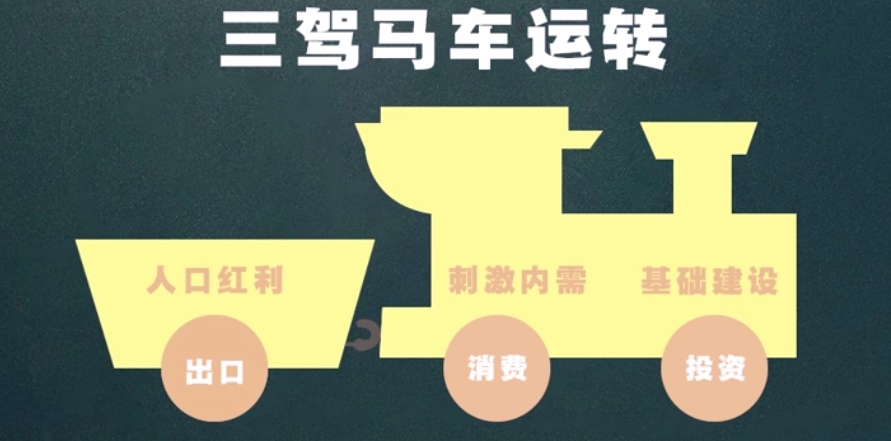

人口红利成为了世界工厂，大量出口廉价质量好的产品（出口）

靠消费拉动经济跑不通

投资基建，高速，机场，修桥，需要钢铁就大量炼钢

投资副总用

    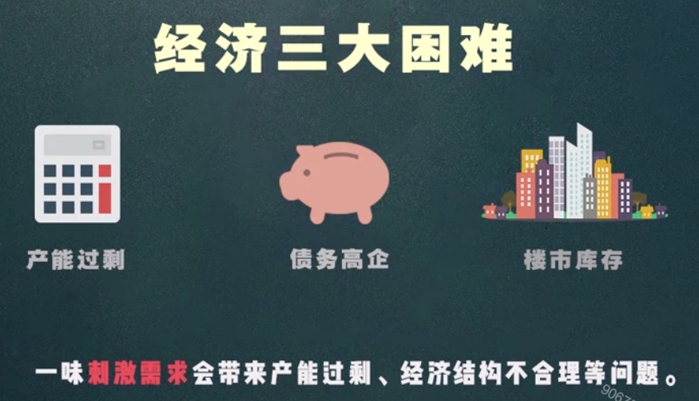

### 供给侧改革

从共给，生产端入手，通过解放生产力，提升竞争力，促进经济发展，具体就是要求清理僵尸企业，淘汰落后产能，将发展方向锁定新型领域，创新领域，创造新的经济增长点。

    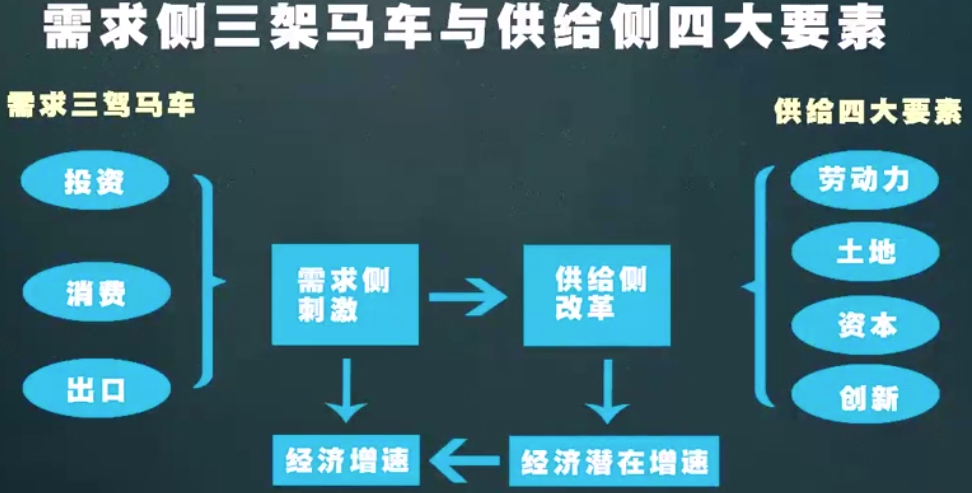

例子：如做蛋糕，以前是让更多人买蛋糕，现在要把蛋糕努力做好，做精致，这样就不愁销量了。

    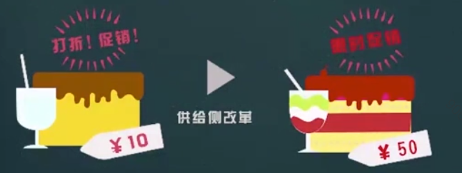

### 供给侧改革四大方面

1. 化解过剩产能：淘汰僵尸企业，加大产业重组。
2. 降低企业成本：通过政策减税，让企业降低成本，有更多资金去创新，提高生产率， 提供优质的产品。
3. 解决买房难，入学难，看病难：从根本解决问题，刺激消费。
4. 防范化解金融风险：形成良好的股票市场，促进经济稳定发展。

> 供给侧改革就是针对我国现有存在的经济问题进行对阵下药，是我国经济改革的新方法。

## 通货膨胀

流通中的货币数量超过经济实际需要而引起**货币贬值和物价水平全面而持续的上涨**。

### 通货膨胀到底好不好？

在经济学中，没有绝对的好与绝对的坏，只要选择对我们有利的选项并且能承担后果就可以。

> 适当的通货膨胀是有利的，价格上涨会刺激厂商生产，而对于消费者来说，因为担心未来物价会涨，大家也愿意多消费，这样经济中需求共给都会增长，经济就会快速增长。

### 膨胀两大指标

CPI：**居民消费价格指数**，用来表示消费品和服务项目价格变动的指数。

计算公式：（一组固定商品按当期价格计算的价值 / 一组固定商品按基期价格计算的价值） * 100%

PPI：**生产者价格指数**，通常是对生产企业来说的，衡量原材料价格变动的情况。
计算公式：（一组固定商品按当期价格计算的价值 / 一组固定商品按基期价格计算的价值） * 100%

CPI 与 PPI 区别和联系

区别：PPI反应生产环节价格的水平，CPI反应消费环节价格水平。
联系：整体价格水平的波动一般出现在生产领域，然后通过产业链向下游产业扩散，最后波及消费品。

### 指标如何使用

#### CPI

当 **CPI>3** %增幅称为 **通货膨胀**

当 **CPI>5%** 增幅称为 **严重的通货膨胀**

当CPI<1%或者是连续下降，表明轻微通货紧缩的趋势

> CPI 指数是 GDP 增长率的 **二分之一多一点** ，超过则是恶性膨胀。

#### PPI

PPI指数越高，上游通货膨胀就越严重，厂家就会涨价，也就导致我们的钱越来越不值钱。

PPI指数过低，也不好，厂家高价买的原材料现在卖出去就会亏本，导致厂家不愿意生产，造成市面上物质匮乏。

这个指数一般来说维持在 0% 附近。

#### PMI

PMI也叫采购经理指数，它是一个综合指数，覆盖多个经济活动的多方面信息，反应了经济总体情况和总的变化趋势。

PMI 通常以50%作为经济强弱分界点，高于50%被解释为经济扩张的信号，当指数低于50%，尤其是接近40%时，则是经济萧条的可能。

#### 术语 同比 环比

- 同比：指与去年这个时候作为比较
- 环比：指与上个月作比较

### 通货膨胀的原因

直接原因

> 钱太多，不值钱了，使得过多货币供应量与商品和劳务量不匹配，必然导致货币贬值，物价上涨，出现通货膨胀

深层原因

- 需求拉动型膨胀：经济体中总需求大于总供给，也就是市场上商品少了，导致物价上升。
- 成本推动型膨胀：工资，利润，原材料
- 输入型膨胀：国外商品价格上涨，国外货币共给增加，国际市场原材料价格上涨

### 通胀影响

**通胀有利于富人，苦的是普通人。通货膨胀的本质是劫贫济富**

    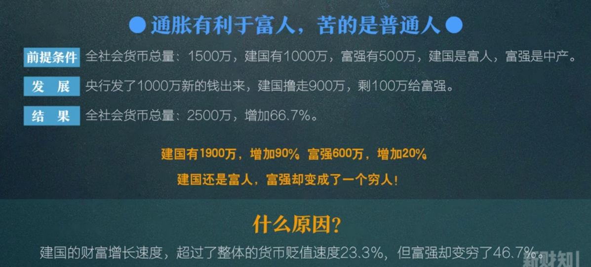

### 如何抵抗通货膨胀

1. 学习财经知识，把握宏观经济，根据CPI指标来体现出通货的预期，做出相应的对策。
2. 了解各种抗通货膨胀工具。
   1. 权益类资产，股票，经济等
   2. 商品类资产，房地产，黄金等
   3. 保险类资产，分红型保险，万能保险，投资连接险等

## 通货紧缩

CPI指数越低，我们认为跌至1%以下，对经济来说，就会产生比较大的危害，长期处于1%以内就认为是通货紧缩。

> 通货紧缩：流通货币减少，购买力上升，影响物价下跌。反应的是企业生产产品太多，而需求不足。

### 通货紧缩原因

通货紧缩最根本原因就是交易媒质相对交易活动缺乏，说白一点就是钞票的数量不够，限制商品需求和交易活动的实现。

    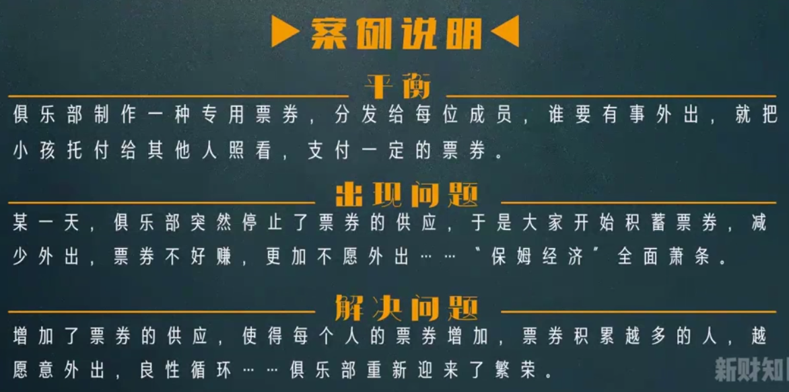

不同观点：

一些观点认为通货膨胀的原因是犹豫需求不足，就是大家消费意愿不足，没人买东西，商品价格就自然而然地下降。

这只是导致通货膨胀的一部分原因，不是根本原因，如果货币充足，大家手里的钱多了，就不会出现意愿不足的情况了，所以通货膨胀的根本原因还是货币不足。

### 通货紧缩的影响

    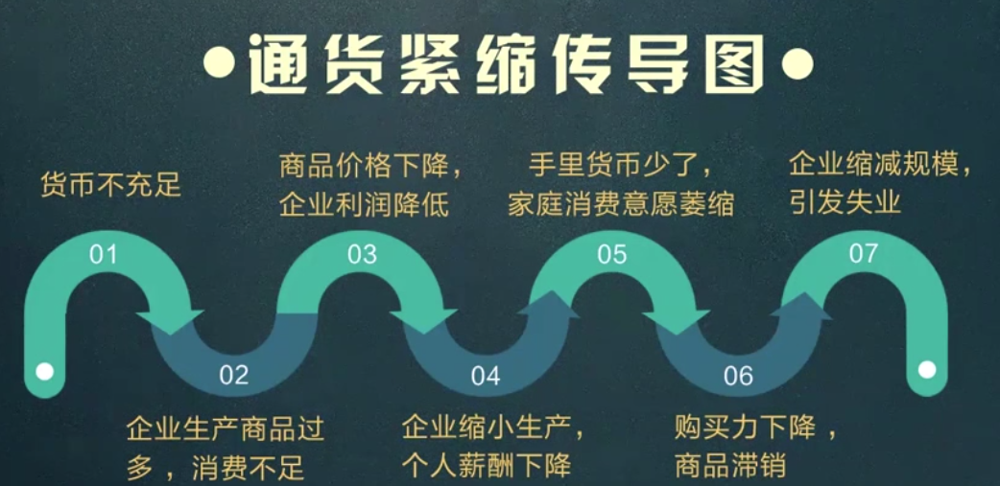

### 失业率

反映一个国家或地区失业状况的主要指标。

一个国家是否稳定失业率是关键。

失业的定义：

一个人愿意并且有能力为获取报酬而工作
但是尚未找到工作的情况，即认为是失业。

失业的判别

自愿性失业
非自愿失业

### 如何抵抗通货紧缩

    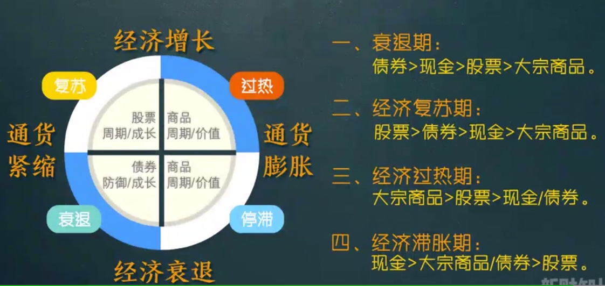

在经济大萧条时期的王者：**现金**。

防御通货紧缩最好的武器：**国债**。

抗通胀的必备品，缩进回避品：**股票**。

## 市场失灵

通过价格的自发调节无法实现供求平衡

从而无法实现资源的最优配置的一种状态。

> 凡事价格手段解决不了的问题基本都可以视为市场失灵。

市场失灵的原因

1. 垄断
2. 外部性
3. 公共物品
4. 信息不对称

> 垄断：在垄断较为严重的市场行业上，商品的共给和价格完全由垄断商决定，他们可能通过限制产量，抬高价格，使价格高于其边际成本，获得额外利润，从而导致市场失灵。

## 市场失灵调节

政府四大经济职能

1. 稳定经济
2. 市场监督
3. 提供公共服务
4. 收入再分配

> 稳定经济：政府提供良好的宏观经济化境，对社会总需求和总供给进行调控，并促进经济结构化调整和优化，保持经济健康发展。

> 提供公共服务：加强城乡公共设施建设，发展社会就业，社会保障服务，为社会公众生活和参与社会经济活动提供保障和创造条件。

> 市场监督 政府保障公平竞争公平交易，维护企业合法权益和对市场进行管理和监督。

> 收入再分配：通过税收和财政支出的形式参与国民收入再分配的国产。

## 政府和企业的关系

政府是裁判，它负责制定规则，在场上监督；企业是球员，他们上场踢球，犯规罚下。

政府是老百姓把日子过的好坏的一把称，也是国民经济平稳运行的支柱，有着举足轻重的作用。

### 财政政策

财政政策是指一国政府为实现一定的宏观经济目标，而调整财政收支规模和收支平衡的指导原则及其相应的措施。

宏观经济目标：

1. **经济适度增长**
2. 收入合理再分配
3. 提高社会生活质量
4. 资源合理配置
5. 物价相对稳定

### 财政政策主体

财政主体分为改革前后

改革前：中央政府，高度集中统一
改革后：地方政府

中央和地方矛盾

- 如果中央政策利于地方政府，那么地方政府顺从；不利的话，地方政府可以和中央商讨，并制定符合该地区情况的政策。
- 中央政府对于各个地区的政策不同。

### 财政政策工具

1. 税收。
2. 公共支出，处于各种财政政策手段中的核心地位。
   1. 购买性支出，也称为财政预算。
   2. 转移性支出，也称为政策补贴。
3. 政府投资
   1. 直接投资，它能改变现有的生产结构，使薄弱不再薄弱，长线不再长线，短线不再短线。
   2. 投资瓶颈行业，把它解决之后就能大大释放民间投资正能量。
4. 国债：国家用信用来抵押，向社会筹资借钱的一种债务凭证。
   1. 调整产业结构，促进国民经济发展。
   2. 调节资金供应，与货币流通。
   3. 调节国民收入使用结构，处理好积累和消费关系。

> 政府补贴相对于税收，有更多的灵活性和针对性，税收一旦指定，可能几年，几十年变化都不大，但是财政补贴就不一样，可根据市场情况随时推出，随时退出。

> 国债是如何调整产业结构？
> 大家买国债，国家有钱了就拿来建设高铁，机场，高速，则需要大量的人力，此时就解决了失业问题；购买原材料又能带动钢铁等产业的发展，大家有钱了，就促进了经济的增长。
> 当通货紧缩的时候，国家就需要使用国债带动的金钱的流通性。

### 财政政策的类型

调节国民经济总量和结构总的不同功能划分

1. 积极财政政策
2. 紧缩性的财政政策
3. 中性的财政政策

调控的目标：社会总共给和社会总需求平衡。
- 总供给：一定时期内由全社会形成的可以购买的商品和劳务总量。
- 总需求：一定时期内由全社会形成用于购买商品和劳务的货币购买力。

总供给和总需求的关系

|总供给和总需求的关系|相对应的财政政策|
|-|-|
|总共给 = 总需求|平衡政策 = 中性政策|
|总共给 < 总需求|结余政策 = 紧缩性政策|
|总共给 > 总需求|赤字政策 = 扩张性政策|

> 紧缩性政策：减少赤字财政支出，增加税收，减少和抑制社会总需求。

> 积极的财政政策：增加赤字支出，减少税收，增加扩大社会总需求。

## 货币政策

1. 货币是如何产生
2. 货币共给量的划分
3. 货币政策三大工具

### 货币是如何产生的？

- 基础货币：货币基数，它是由中央银行发行的债务凭证，表现为商业银行的存款准备金和公众持有的通货。
- 派生货币：银行逐级产生的存贷款而创造出来的货币。

    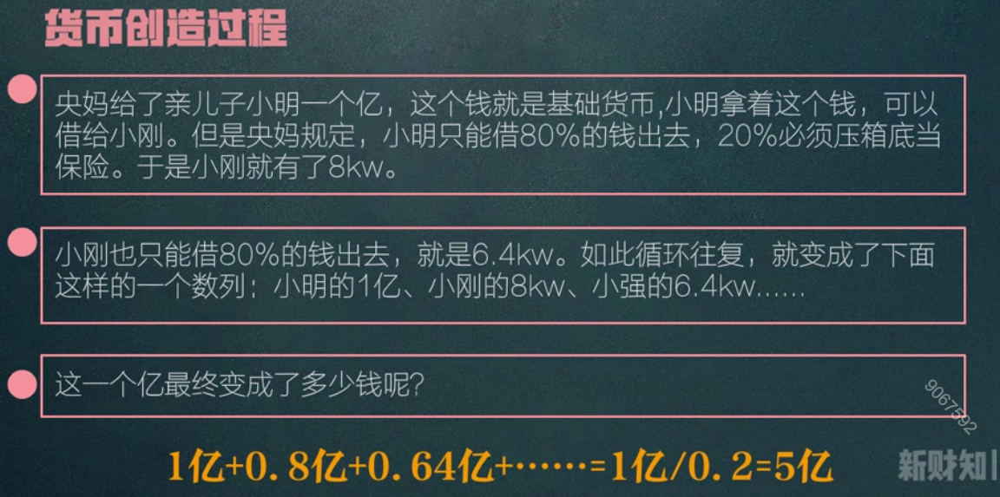

货币创造的三个步骤：

1. 央妈给的钱，学名叫做**基础货币投放**。
2. 孩子们规定留一部分压箱底的钱，学名叫做**存款准备金**，
3. 孩子们互相借钱，学名叫做**信用派生**。

### 货币供应量如何划分

1. **M0** 流通中的现金：银行体系外各个单位库存现金和居民手持金之和。
2. **M1** 狭义货币供应量：通常指 M0 + 商业银行的货期存款。
3. **M2** 广义的货币供应量：通常是指 M1 + 商业银行的定期存款和储蓄存款。
4. **M3** 其他货币性短期流动资产。

> M1 反映着经济中现实购买了；M2 不仅仅反应现实购买力，还反应潜在的购买力。

> 若 M1 增长增长较快，则证明消费和终端市场活跃；
> 若 M2 增长较快，则投资和中间市场活跃。

> 若 M2 过高，M1 过低表明投资过热需求不旺，有危机风险；
> 若 M1 过高，M2 过低需求强劲，投资不足，有涨价风险；

### 货币政策三大工具

1. 存款准备金率：指商业银行缴存在中央银行的存款，这部分存款是用来做准备金的，而这个准备金占其存款总额的比例就是存储准备金率。
   1. 利率政策：简单来说就是央行对商业银行实行加息，降息的政策。
2. 公开市场操作：就是央行直接参与资本市场融资行为，通过债卷及其他方式向市场投放或收缩流动性。
   1. 正回购：央行卖出有价证券，并在未来买回有价值的证券行为，正回购为央行从市场收回流动性的操作，正回购到期则为央行向市场投放流动性的操作。
   2. 逆回购：央行向市场购买有价值证券，并在特定日期卖出的交易；逆回购为央行向市场投放流动性的操作，逆回购到期则央行从市场收回流动性操作。
3. 体现率
4. 附加工具-外汇
#### 存款准备金率

> 存款准备金率：央妈要求各银行 **存款准备金** 加大，钱的流通就变小了。

利率政策如何影响货币流量？

- 张三10万存银行只有2.5%利率，央行上调0.5%，就是变成3%，更愿意存钱去银行。
- 李四开工厂，贷款1000万，一年利率是5.5%，当央行实行上调利率就变成6%，李四更加不愿意贷款。 

> 提高利率，银行的存款增加了，整个市场的货币流通减少了，从而起到了调节市场货币量的作用。

重点提示：

> 在实际操作中，相比利率，存款准备金率政策使用次数会更多点，非常时期这两个手段会同时使用。但是不到非常时期，**国家一般不会动用调整利率政策**，因为涨跌都会对企业或者是居民带来伤害。

#### 公开市场操作

1. MLF 中文叫中期借贷遍历，俗称麻辣粉，是指中央银行提供中期基础货币的货币政策工具。于2014年9月由中国人民银行创设。对象为符合宏观审慎管理要求的商业银行、政策性银行，可通过招标方式开展。发放方式为质押方式，并需提供国债、央行票据、政策性金融债、高等级信用债等优质债券作为合格质押品。
2. SLF 短期借贷便利。
3. PSL 抵押补充贷款。

#### 外汇

外汇：指本国货币以外的其他国家货币资产，包括现金，存款和各种有价值的证券

外汇储备：国家为了应付国际需要，各国的中央银行及其他政府机构所集中掌握的外汇资产。

汇率：一个国家货币与一个国家货币的价值。

#### 总结

经济过热

央行操作手法：加息、加存储准备金率。
公开市场操作：麻辣粉，酸辣粉，进行逆回购减少市场流通货币数量。
外汇手段：投放外汇储备，回收人民币资产，以缩减市场流通量。
再贴现手段：降低贴现率，缩减杠杆操作。

经济偏冷

央行操作手法：降息、降准释放货币流通率。
公开市场操作：麻辣粉，酸辣粉，进行市场投放，来增加市场流通货币数量。
外汇手段：增加外汇储备，投放人民币资产，释放市场流通量。
再贴现手段：提高贴现率，增加杠杆操作。

提示

> 利率政策和存储准备金政策，药力过猛，对市场影响较大，不轻易使用
> 央行喜欢公开操作。
> 贴现率手段很少使用。

## 金融危机

### 金融危机以及类型

定义：金融危机是指一个国家以及地区全部或者大部分金融指标（如：短期利率，货币资产，证券，房地产，土地，商业破产和金融机构倒闭）的急剧，短暂，超周期的恶化。

金融危机的类型

1. 货币危机：一个国家的汇率变动超过了一个国家可以承受的范围。
2. 债务危机：国家在国际借贷领域中大量负债，超过了借贷者自身偿还能力，造车无法偿还或者延迟偿还现象。
3. 银行危机：银行过度涉及高风险行业，比如房地产，股票，从而导致资产负债严重失衡，贷账负担过重而使资本运营破产。

### 金融危机产生

东南亚金融危机

    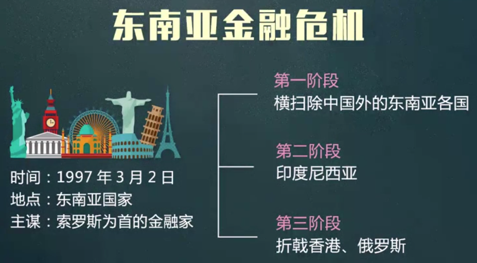

金融爆发原因：

> 经济在持续增长过程中，产生了与供求关系过节的偏差，而这个偏差就是我们所说的**泡沫**。当泡沫不断增大的同时，带动其他联动行业的虚增假象，所以在不断的疯狂增长中，最后只能破灭。

### 金融危机影响

1. 企业倒闭
2. 失业率增高
3. 社会经济普遍大萧条
4. 社会共给导致生产能力下降。
5. 大众居民消费购买能力下降，生活无法保障，影响社会矛盾。

    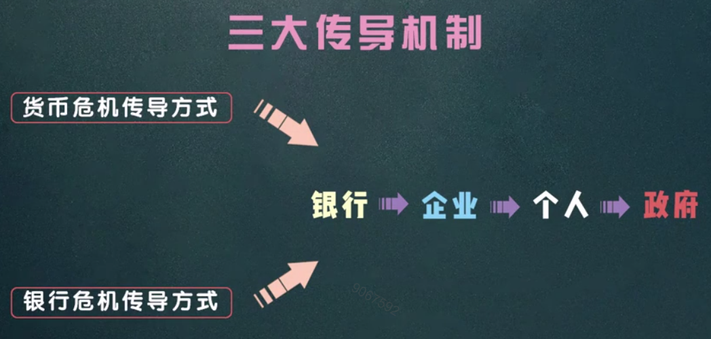

### 金融危机应对

月光族：消减债务，多存钱，多学赚钱的技能，最重要是保证不失业。

爱攒钱的人：学会躲避风险，手里风险高的资产迅速甩手，比如股票，大宗商品和外汇等做多为主的资产。

土豪：该回避的风险回避，包括股市，外汇，以及各种前期涨势最凶的产品。

> 金钱是需要不断打理才能持续增值，只有不断的改变自己来适应经济环境的改变，才能保证自己现在安稳的生活。